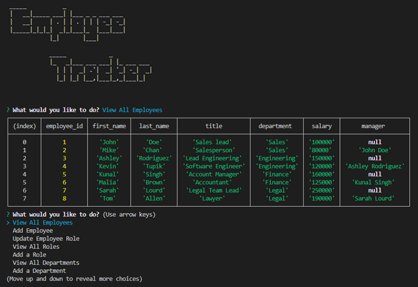

  
  # SQL: Employee Tracker



  ## Table of Contents
  - [Description](#project-description)
  - [Installation](#installation)
  - [Usage](#usage)
  - [Contact](#contact)


  ## Project Description
  This project creates a content management system using node.js and MySQL  
  It allows the user to view, add to, or modify an employee database.

  ## User Story

```md
AS A business owner
I WANT to be able to view and manage the departments, roles, and employees in my company
SO THAT I can organize and plan my business
```

## Acceptance Criteria

```md
GIVEN a command-line application that accepts user input
WHEN I start the application
THEN I am presented with the following options: view all departments, view all roles, view all employees, add a department, add a role, add an employee, and update an employee role
WHEN I choose to view all departments
THEN I am presented with a formatted table showing department names and department ids
WHEN I choose to view all roles
THEN I am presented with the job title, role id, the department that role belongs to, and the salary for that role
WHEN I choose to view all employees
THEN I am presented with a formatted table showing employee data, including employee ids, first names, last names, job titles, departments, salaries, and managers that the employees report to
WHEN I choose to add a department
THEN I am prompted to enter the name of the department and that department is added to the database
WHEN I choose to add a role
THEN I am prompted to enter the name, salary, and department for the role and that role is added to the database
WHEN I choose to add an employee
THEN I am prompted to enter the employee’s first name, last name, role, and manager, and that employee is added to the database
WHEN I choose to update an employee role
THEN I am prompted to select an employee to update and their new role and this information is updated in the database 
```
  
  ### License 
  
  [](https://choosealicense.com/licenses/mit/.)
  
   
  ## Installation 
  Clone the repo, then open the project in VS Code  
  Open the project in the terminal and use 'npm install' to install all dependencies

  ## Usage 
  In the terminal use 'npm start' to start the program  
  Use the command line options to choose the desired functions of the Employee Tracker application.  
  Follow the prompts and enter information as needed.  

  
  ## Contact
  Please contact [CML120](https://github.com/CML120) at cheelor922@gmail.com with any questions.


https://github.com/CML120/SQL-Employee-Tracker/assets/126404917/362bc695-3d13-4ae0-8bd0-8e7a4d200528


